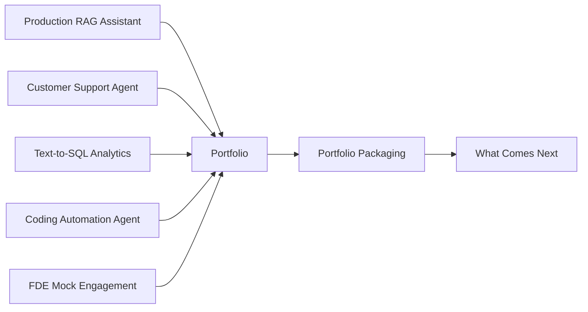

# Phase 12: Capstones - Build the Portfolio

7 capstone projects. ~18 hours. Integrate all prior phases into shipped, evaluated, documented systems that form a portfolio for Applied AI Engineer and FDE roles.

## The through-line

A capstone is not a tutorial project. It is a system that: handles real failure modes, has been evaluated against a golden test set, includes a deployment runbook, and produces an artifact a hiring manager or customer can review. Each capstone in this phase integrates skills from multiple prior phases and ships a complete system - not a prototype.

## What you build

## Projects

| # | Project | Integrates | Artifact | Time |
|---|---------|-----------|----------|------|
| 01 | Production RAG Assistant Over a Real Corpus | P02, P05, P06, P07, P08 | `runbook-rag-assistant-deploy.md` | ~3 hrs |
| 02 | Customer-Support Agent with Tools, Guardrails, HITL | P03, P04, P05, P08 | `runbook-support-agent-deploy.md` | ~3 hrs |
| 03 | Talk-to-Your-Data Analytics App (Text-to-SQL) | P01, P05, P06, P08 | `runbook-text-to-sql-deploy.md` | ~2.5 hrs |
| 04 | Coding Automation Agent on a Real Repo | P03, P04, P05, P08 | `runbook-coding-agent-deploy.md` | ~3 hrs |
| 05 | FDE Mock Engagement: Scope, Ship, Handoff | P11, P04, P05, P06 | `runbook-fde-engagement-playbook.md` | ~3 hrs |
| 06 | Portfolio Packaging and Interview Prep | All phases | `prompt-portfolio-presentation-guide.md` | ~1 hr |
| 07 | What Comes Next | All phases | `prompt-continued-learning-map.md` | ~30 min |

## Prerequisites

All prior phases. The capstones assume you have completed the skills in Phases 00-11 and are ready to integrate them into production-grade systems.

## Stack

- Python + `anthropic` SDK (all capstones)
- `fastapi` + `uvicorn` (L01, L02, L03)
- `numpy` + `rank-bm25` (L01)
- `sqlite3` stdlib (L03)
- Docker (L01, L02, L03, L04, L05)
- All capstones include a demo mode that works without external API keys
