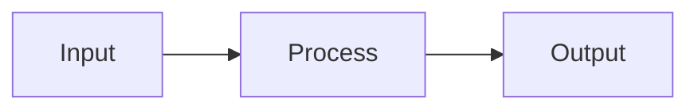

# Slide Deck Authoring Guide

Facilitator decks for learning circles and workshops. One deck per phase. Generated with Marp.

## Setup

```bash
npm install -g @marp-team/marp-cli
# or use npx (no install needed):
npx @marp-team/marp-cli slides/phase-00-setup.md --theme slides/theme.css --html
```

## Build all slides locally

```bash
npx @marp-team/marp-cli --input-dir slides/ --theme slides/theme.css --html --output site/slides/
```

## Build PDF for a deck

```bash
npx @marp-team/marp-cli slides/phase-00-setup.md --theme slides/theme.css --pdf --output site/slides/
```

---

## File naming

```
slides/phase-NN-short-name.md
```

Examples:
- `slides/phase-00-setup.md`
- `slides/phase-02-rag.md`
- `slides/phase-04-agents.md`

---

## Deck structure (required)

Every phase deck follows this structure:

```
1. Title slide           — phase name, lesson count, time estimate
2. Who this is for       — audience, prerequisites
3. What you'll build     — the artifacts and capstone
4. The through-line      — the core problem this phase solves
5-N. Lesson slides       — 2-4 slides per lesson (concept, code, diagram, exercise)
N+1. Discussion prompts  — 3-5 facilitator questions for group discussion
N+2. Exercises           — easy / medium / hard
N+3. Further reading     — curated 3-5 links
N+4. What's next         — bridge to the next phase
```

Minimum: **25 slides per phase.** Most phases should be 30-45 slides.

---

## Slide layouts

### Title slide (first slide only)
```markdown
---
marp: true
theme: applied-ai
class: title
paginate: true
footer: 'Applied AI From Scratch · Phase NN'
---

# Phase NN: Title
## Subtitle — tagline

Phase NN of 13 · N lessons · ~N hours
```

### Section header (between lesson groups)
```markdown
---
<!-- _class: section -->

# Lesson NN
## Lesson title
```

### Standard content slide
```markdown
---

## Slide Title

- Bullet one
- Bullet two — **emphasis** on key terms
- Bullet three

> **Key insight:** Use blockquotes for the core takeaway.
```

### Code slide
```markdown
---
<!-- _class: code -->

## Code: What it does

```python
def example():
    return "kept short — max 20 lines visible at once"
```

One concept per code slide. Strip all boilerplate.
```

### Diagram slide (mermaid)
```markdown
---

## How it works


```

### Two-column split
```markdown
---
<!-- _class: split -->

## Comparison

**Approach A**
- Point 1
- Point 2

**Approach B**
- Point 1
- Point 2
```

---

## Writing rules

1. **One idea per slide.** If you need a second idea, add a slide.
2. **Code blocks: max 20 lines.** Strip imports, boilerplate, error handling unless it IS the point.
3. **Every lesson gets a "The Problem" slide.** State the production pain before the solution.
4. **No em dashes.** Use colons or commas.
5. **Diagrams first, then explanation.** Show the mermaid diagram, then the bullets.
6. **Speaker notes** go in HTML comments below the slide:
   ```
   <!-- 
   SPEAKER: Emphasize that this is the step most teams skip.
   Ask: has anyone in the room shipped something to prod without evals?
   Time: ~3 min
   -->
   ```
7. **Discussion slides** use the `> **Facilitator prompt:**` blockquote format.

---

## Slide count targets per lesson count

| Phase lessons | Target slides |
|---------------|---------------|
| 9-10 lessons  | 28-35 slides  |
| 13-14 lessons | 35-45 slides  |
| 16 lessons    | 40-50 slides  |

---

## Phases with completed decks

| Phase | File | Status |
|-------|------|--------|
| P00: Setup & Mindset | `phase-00-setup.md` | Done |
| P02: Retrieval & RAG | `phase-02-rag.md` | Done |
| P01: Prompt & Context | — | To do |
| P03: Tools & MCP | — | To do |
| P04: Agents | — | To do |
| P05: Evaluation | — | To do |
| P06: Shipping | — | To do |
| P07: Observability | — | To do |
| P08: Security | — | To do |
| P09: Fine-Tuning | — | To do |
| P10: Multimodal & Voice | — | To do |
| P11: FDE Skillset | — | To do |
| P12: Capstones | — | To do |

---

## Authoring a new deck (step by step)

1. Read the phase README: `phases/NN-phase-name/README.md`
2. Read each lesson's `docs/en.md` for the lesson narrative
3. Create `slides/phase-NN-name.md`
4. Start with the title slide, through-line, and what-you-build
5. For each lesson: write "The Problem" slide first, then concept, then code, then diagram
6. Add discussion prompts and exercises at the end
7. Build locally: `npx @marp-team/marp-cli slides/phase-NN-name.md --theme slides/theme.css --html`
8. Open the HTML, run through as a facilitator would
9. Update the status table above
10. Commit: `git add slides/phase-NN-name.md && git commit -m "feat(slides): Phase NN facilitator deck"`
